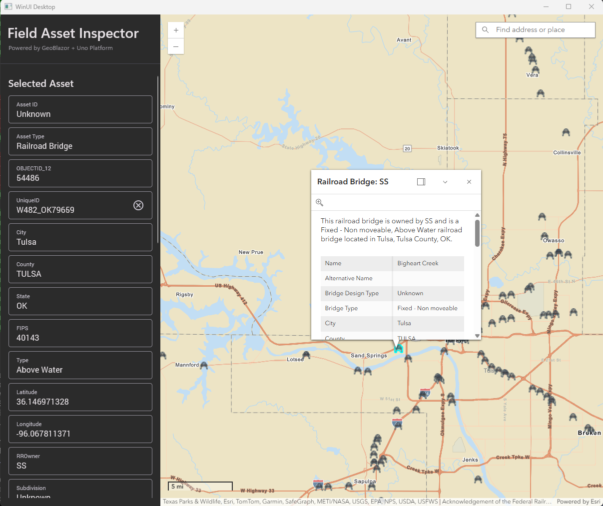

# Field Asset Inspector

A cross-platform **Uno Platform** application demonstrating **GeoBlazor** map integration via MAUI Embedding.

[Read the blog post](https://geoblazor.com/blog/bridging-multiple-platforms-with-geoblazor-and-uno)



## Overview

This sample showcases how to embed GeoBlazor mapping capabilities inside an Uno Platform app using the MAUI Embedding feature. Users can interact with an ArcGIS map to view and inspect attributes of railroad bridge assets.

### Architecture

The solution consists of three projects:

| Project | Purpose |
|---------|---------|
| **FieldAssetInspector** | Uno Platform host app — provides the native XAML shell with sidebar and asset detail panel |
| **FieldAssetInspector.MauiControls** | .NET MAUI class library — wraps a `BlazorWebView` in a `ContentView` for embedding in Uno via `MauiHost` |
| **FieldAssetInspector.Razor** | Razor Class Library — contains the GeoBlazor map component, feature layer configuration, and hit-test interaction logic |

```
┌─────────────────────────────────────────────────────┐
│  Uno Platform App (XAML)                            │
│  ┌──────────┐  ┌────────────────────────────────┐   │
│  │ Sidebar  │  │  MauiHost                      │   │
│  │ (XAML)   │  │  ┌──────────────────────────┐  │   │
│  │          │  │  │ BlazorWebView            │  │   │
│  │ - Asset  │  │  │  ┌────────────────────┐  │  │   │
│  │   ID     │  │  │  │ GeoBlazor Map      │  │  │   │
│  │ - Type   │  │  │  │ + Feature Layer    │  │  │   │
│  │ - Attrs  │  │  │  │ + Widgets          │  │  │   │
│  │ - Notes  │  │  │  └────────────────────┘  │  │   │
│  │          │  │  └──────────────────────────┘  │   │
│  │ [Save]   │  └────────────────────────────────┘   │
│  └──────────┘                                       │
└─────────────────────────────────────────────────────┘
```

### Supported Platforms

Via Uno Platform + MAUI Embedding:

- **Windows** (WinAppSDK)
- **Android**
- **iOS**
- **macOS** (Mac Catalyst)

> **Note:** The WebAssembly (`browserwasm`) target is not included because MAUI Embedding (and thus `BlazorWebView`) is not supported on Uno's WASM target. For a web-hosted GeoBlazor experience, see the other sample projects in this repository.

## Prerequisites

- .NET 10.0 SDK
- Uno Platform SDK (`Uno.Sdk 6.5.31` — defined in `global.json`)
- An **ArcGIS API key** ([get one free](https://developers.arcgis.com/sign-up/))
- A **GeoBlazor license key** ([dymaptic.com](https://www.dymaptic.com))

## Configuration

Set your API keys in `FieldAssetInspector/appsettings.json`:

```json
{
  "ArcGISApiKey": "YOUR_ARCGIS_API_KEY"
}
```

Or use .NET user secrets for local development.

## Build & Run

```bash
cd projects/FieldAssetInspector

# Windows (WinAppSDK)
dotnet build FieldAssetInspector/FieldAssetInspector.csproj -f net10.0-windows10.0.26100

# Android
dotnet build FieldAssetInspector/FieldAssetInspector.csproj -f net10.0-android

# iOS
dotnet build FieldAssetInspector/FieldAssetInspector.csproj -f net10.0-ios
```

## Features Demonstrated

- **Uno Platform XAML** — Native sidebar with `TextBlock`, `TextBox`, and `Button` controls using Material theme
- **MAUI Embedding** — `MauiHost` control embedding a `BlazorWebView` inside Uno XAML
- **GeoBlazor** — `MapView` with `FeatureLayer`, `PictureMarkerSymbol` renderer, and interactive hit-testing
- **Cross-boundary communication** — Singleton `AssetSelectionService` bridges events from Blazor to native XAML
- **Cross-platform** — Single codebase targeting 4 platforms via Uno Platform

## Data Source

The sample uses Esri's public [Railroad Bridges](https://www.arcgis.com/home/item.html?id=c553cf96679d4454b1d60aa0b6a268f9) portal item, displaying bridge locations as point features with a custom `PictureMarkerSymbol`.
